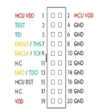

# MD10 board

Environnement setup : 

Software :

 STM32CubeIDE : for compilation debugging and flashing 
		
 STM32CubeProgrammer: for deactivate write protection bit

Hardware : LoRaWAN gateway connected to LoRaWAN server (TTN)

# MELLIA - Kit Dadant 10

## Présentation

Le kit Mellia Dadant 10 est un ensemble de capteurs connectés permettant d’obtenir des informations essentielles relatives à l’exploitation d’une ruche dans l’objectif de suivre l’évolution de la colonie en réduisant le nombre d’interventions intrusives et les déplacement de l’apiculteur.

Ce kit s’adapte sur une ruche Dadant 10, le modèle le plus utilisé actuellement. Il comprend un dispositif de pesée électronique, un dispositif de mesure de température et humidité intérieure et extérieure, un capteur de pression atmosphérique ainsi qu’un module de communication sans fil. L’ensemble des acquisitions sont enregistrées dans une base de données, un tableau de bord permet le suivi de l’état de la ruche.

## Fonctionnalités

### Mesure poids de la ruche

On pèse la ruche à intervalle régulier pour faire remonter une donnée sur la masse à l’apiculteur. Cela permet d’obtenir un indice de l’état de santé de la colonie et d’envisager d’intervenir ou non sur la ruche (rajout de candi, miellée etc). 

### Température extérieure

Une captation de température dans l’environnement immédiat de la ruche renseigne l’apiculteur sur la météo du milieu dans lequel évolue la colonie d’abeille et donne la capacité d’anticiper une miellée par exemple.

### Température intérieure

La mesure de la température à l’intérieur de la ruche fournis une information sur l’état de santé du couvain. Pour se développer correctement sa température doit rester dans une plage de mesure de 18 à 35°C. Sortir de cette plage indique un danger pour la colonie. Des variations régulières de la température est un signe d’essaimage.

### Humidité extérieure

Utile au rafraîchissement de la ruche ou intervenant directement dans la probabilité de voir se développer des champignons, le taux d’humidité intervient directement dans la vie de la colonie et le mesurer peut se révéler être un élément clé pour comprendre l’activité de la ruche.

### Humidité intérieure

Cette donnée a une incidence sur l’état de santé du couvain, en effet si celui ci est trop humide les parois en deviennent fragiles. Le taux d’humidité est aussi un bon indicateur de la qualité du miel.

### Pression atmosphérique

En corrélation avec l’humidité et la température extérieure, la pression atmosphérique fournit à l’apiculteur une vision globale sur le milieu à proximité de la ruche et sur les éléments auxquels sont soumis les abeilles 

### [Tableau de bord](https://grafana.mellia.lab.open.studio/login "https://grafana.mellia.lab.open.studio/login")

Pour faciliter l’information et la prise de décision les données sont rassemblées dans un tableau de bords consultable en ligne.

## Notice

### Composants du kit

Pour les composants sur la carte se référer au document md10-board/hardware/wheather_board_v1/wheather_board_v1.csv

| composant                            | référence                |
| ------                               | ------                   |
| jauge de contrainte                  | tedea 1242               |
| antenne                              | MOLEX  105262-0001       |
| boîtier                              | TAM 131007 ENCLOSURE     |
| panneau solaire + batterie           |                          |

### Montage

### Mise en œuvre

## Software 

**Prérequis** : 

Télécharger le logiciel STM32CubeIDE : <https://www.st.com/en/development-tools/stm32cubeide.html>

Télécharger le logiciel STM32CubeProgrammer : <https://www.st.com/en/development-tools/stm32cubeide.html>

Télécharger le code grâce à la commande suivante : 

Git clone <https://gitlab.openstudio-lab.com/mellia/mellia.git>

**Ouvrir le projet :** 

Ouvrir stm32CubeIde, sélectionner ~/md10-board/software/ruche\_soft comme workspace

Depuis STM32CubeIDE, cliquer sur File et « Open Project from file system »

Dans la fenêtre qui s’ouvre cliquer sur directory et sélectionner : ~/md10-board/software/ruche\_soft/STM32Cube\_FW\_WL\_V1.1.0/Projects/NUCLEO-WL55JC/Applications/LoRaWAN/LoRaWAN\_End\_Node/STM32CubeIDE

Les librairies des composants sont accessibles depuis Drivers. Le dossier Sensors contient les fonctions des différentes de mesures, poids, température etc.

Application contient le code de la machine à état qui fait tourner le programme mais aussi les drivers des périphériques de communication tel que le SPi l’i2c ou encore le protocole de communication LoRaWAN servant à faire remonter les données.

L’acquisition des mesures est faite au cours de la fonction SendTxData située dans lora\_app.c

**Flasher le programme :**

Connecter le debugger : 

Se connecter au microcontrolleur en utilise STM32Cubeprogramme et désactiver la protection en écriture : 

Pour lancer le debugger depuis stmcubeide appliquer cette configuration depuis Run -> debug configuration : 

Attention pour des raisons d’optimisation la sonde de debug et le mode low power est activé. Pour faire plus que flasher le code est debugger en mode pas à pas il faut se rendre dans sys\_conf.h et régler sur 1 les #define suivants : DEBUGGER\_ENABLED et LOW\_POWER\_DISABLE

**Procédure de calibration de la balance** 

On utilise les équations données par TI dans le document relatif à la bonne utilisation de la carte ADS1242 : 

On a besoin de 3 paramètres : 

- wfs  : la masse la plus proche possible de la pleine échelle
- Cfs  : la sortie de l’dc correspondant à wfs
- Czs : la sortie de l’adc lorsque la balance est à vide

À l’aide de ces trois données on peut en déduire l’équation 1 puis la 2 . On place un points d’arrêt dans le code après la mesure pour récupérer cfs et czs.

Les paramètres wzs et m sont à introduire en dur dans le code dans la fonction d’initialisation de l’ads1232 : void ADS1232Sensors\_Init(sensor\_t \*sensor\_data) 

Lors de l'assemblage d'une nouvelle balance, il est important de sélectionner les variables pour une jauge de 100kg ou de 250kg dans la fonction ADS1232Sensors_Init() contenu dans weight_sensor.c

#### Node-red

Node-red est un outil de développement basé sur les flux. Il sert ici à récupérer les données en provenance du broker MQTT fournit par TTN et à les enregistrer dans une base de donnée influxDB. Les ressources pour le déployer se situe dans le répertoir software

Pour se connecter au broker on commence par ajouter le module MQTT à l'interface node red en suivant ce tutoriel : 
https://www.thethingsnetwork.org/forum/t/mqtt-in-node-red-howto/39909

NB : nous utilisons Orange plutôt que TTN pour recevoir les données LoRa mais le principe est le même 

